# Gender Inequality quiz
 <a href="https://aslinedvinsson.github.io/gender_inequality_quiz/" target="_blank">The Gender Inequality Quiz</a>

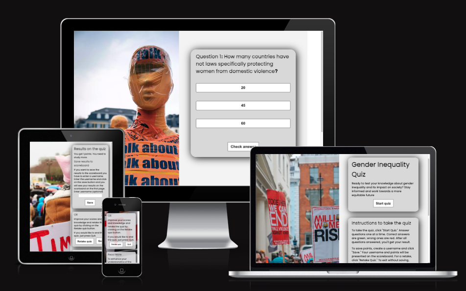

## Introduction
The quiz is an interactive quiz about gender inequality, comprising ten questions, each with three answer options. When a unser selects an option, they can change there mind until they press Check answer button. Once the user checked answer, they will receive immediate feedback through color indicators on the options. If the chosen option is correct, it will turn green; if it is incorrect, it will turn red. 

At the end of the quiz, after the user has answered all the questions, the results, including the number of correct answers, will be displayed. Users than have the option to create a username, which will be shown on the first page along with the quiz result. They can also choose to retake the quiz for a better result by clicking the "Retake Quiz" button, which will take them back to the first question, or they can exit the game by clicking the "Quit" button and return to the initial page.

## Target user
The target audience for this quiz includes individuals who wish to evaluate their comprehension of gender inequality and, through participating in the quiz, expand their knowledge on the subject.

## Design
**Introduction page** Text about the quiz, instruction on how to take the quiz and scoreboard
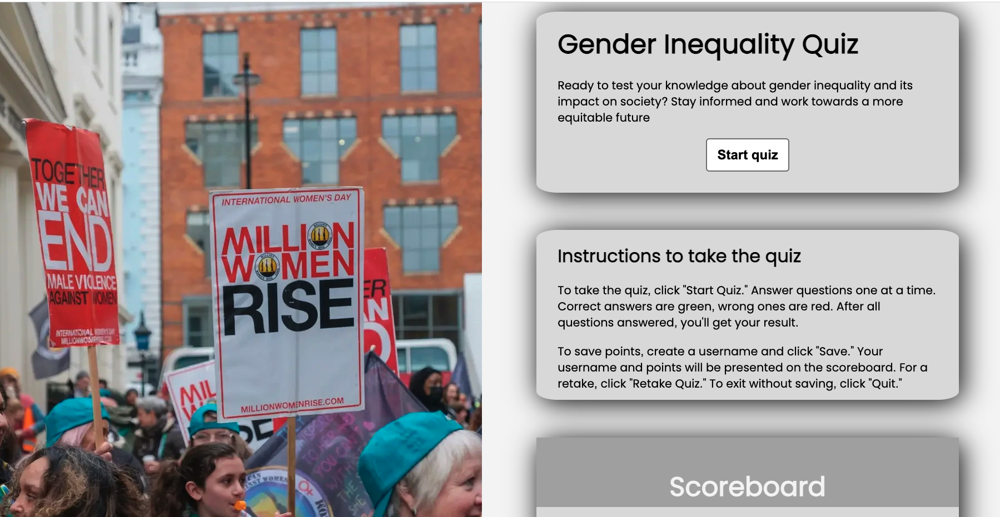

**Questions** Displayed one at the time
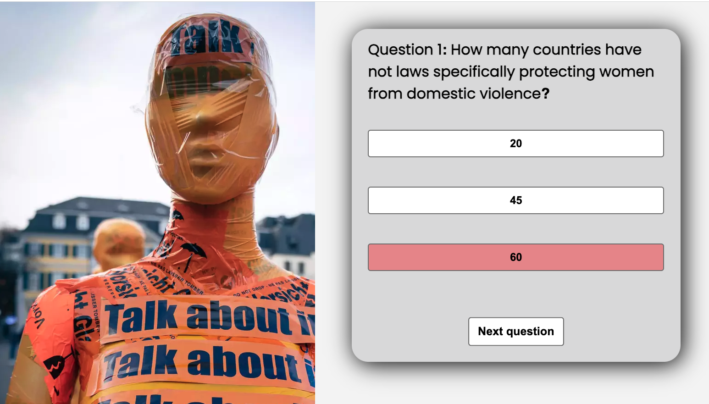

**Resultpage** On this page, you will find the outcome of the quiz you've just completed, along with instructions on how to save your result by creating a username. You can also choose to retake the quiz or exit the quiz.
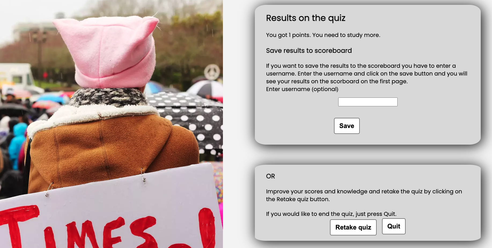

**Scoreboard** Showing points afte three users taken the quiz, if they created a username.
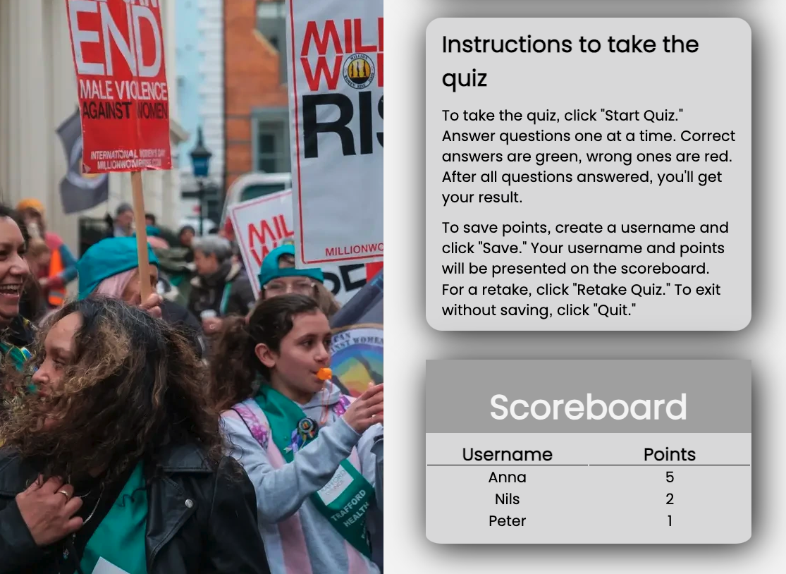

**Mobile device** The images are displayed in the background of the text on mobile device

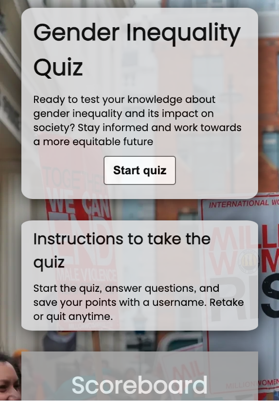

### Wireframes
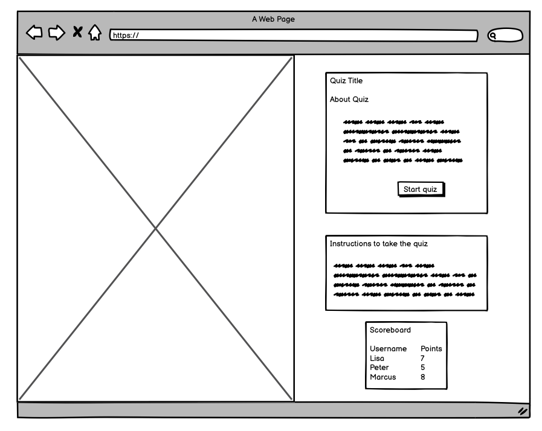
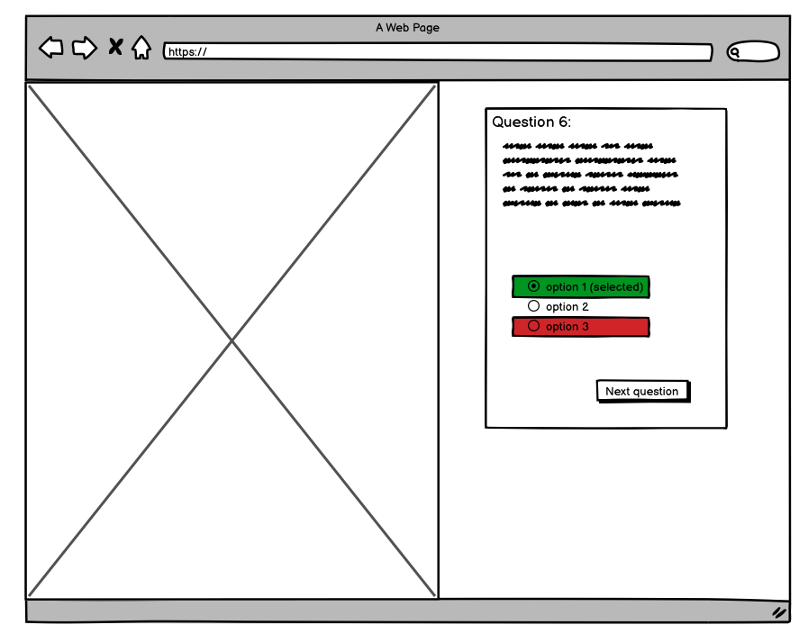
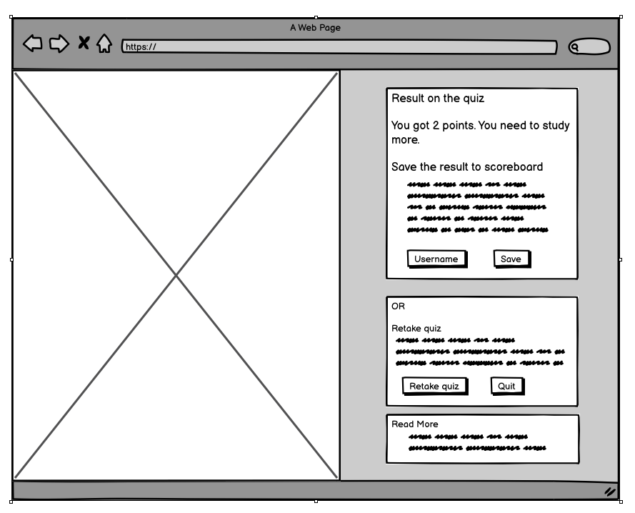
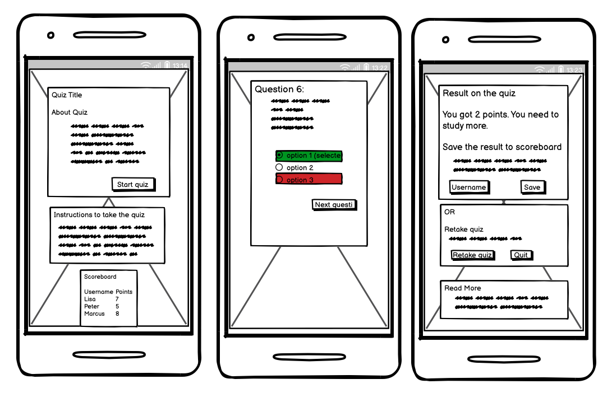

### Fonts 
Poppins is a sans-serif typeface with a geometric design. It's open-source and is characterized by the Indian Type Foundry as an "internationalist interpretation of the geometric sans-serif style." You can access Poppins for free on Google Fonts. Poppins conveys a sense of modernity and seriousness, aligning well with the theme of the quiz. The fallback font is san-serif.

### Colors 
The quiz, focusing on a serious theme of gender inequality, employs a subdued color palette of white and gray to convey neutrality. This approach avoids vibrant and colorful elements that might suggest happiness or joy.

The primary color used on the website is "Whitesmoke," which is a slightly grayish off-white shade. Whitesmoke is a neutral color that complements most other colors. Since the quiz incorporates colored images with impactful messages, both Whitesmoke and gray are chosen to maintain text neutrality while harmonizing with a wide range of colors.

When a user selects an option, it changes to a light blue shade, providing clear feedback about the chosen option. When the user subsequently clicks the "Check Answer" button, the selected response will either turn green if it's correct or red if it's incorrect. These color choices (green and red) are used for their universally recognized associations with correctness and errors. The blue, green, and red colors are coordinated with the gray used in the text boxes, creating a cohesive visual experience.

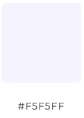 
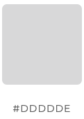 
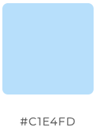 
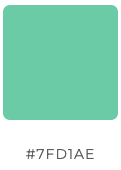 
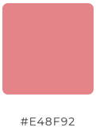 
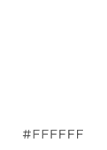 
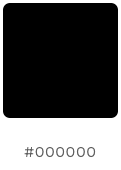

### Images
Images are sourced from [Unsplash](https://unsplash.com/), resized, to fit the website's design. The photographers are appropriately credited in the credit section.

### Text
The sources for the factual information used to create the quiz questions and answers can be located in the Credits section. The questions are formulated and all other text is authored by the creator of the website.

## Features

### Existing features
- A "Start Quiz" button that, when clicked, appears to take the user to a new page but, in reality, it reveals a separate div while hiding the initial div.

- Option buttons present three different answers for each quiz question. In JavaScript, the options have different indexes based on whether they are the right or wrong answer.

- The option buttons change colors. When a user clicks on an option, it turns light blue to indicate their selection. Users can change their mind by clicking on another option, which will then turn blue. Once the user makes a final selection, they can press the "Check Answer" button. The selected answer will turn green if it is correct or red if it is wrong.

- The "Check Answer" button is followed by a "Next Question" button. When the "Check Answer" button is clicked, it is hidden, and the "Next Question" button is displayed.

- An alert message appears on the "Check Answer" button if the user attempts to click it before selecting an option.

- On the last question, instead of the "Next Question" button, a "Show Results" button is shown. Clicking this button appears to take the user to a new page, but it actually reveals a previously hidden div.

- A points counter that tallies the number of correct answers. On the last page, the total points are displayed along with a message based on how many correct answers the user has achieved.

- A form that allows users to create a username. If the user wishes to save their results, they can optionally enter a username in the form and click the "Save" button or click Enter. The first page will then display a scoreboard with the username and the number of points the user has earned.

- An alert message appears if the user presses the "Save" button before entering a username.

- A scoreboard is designed to showcase usernames and their corresponding points for users who have participated in the quiz at least once. In the event that a user opts to take the quiz a second time using the same username, the scoreboard will dynamically update the points while retaining the original username. However, when the page is reloaded, the scoreboard is reset. For illustration purposes, Nils and Anna are fictitious individuals who have previously taken the quiz, and their respective points are displayed on the scoreboard. This provides subsequent users with a reference point, allowing them to understand how points are presented and fostering a sense of competition as they strive to outperform these earlier participants.

- A "Retake Quiz" button takes the user back to the first question of the quiz. The "Retake" button also resets the points from the previous attempt.

- A "Quit" button returns the user to the first page without saving a username or points and resets the quiz.

- A "Read More" section with links to various websites where users can learn more about gender inequality.

### Future features

- A database that saves usernames and points over time even if the page is reloaded.

- A wider selection of question which randomly are presented. 

## Languages, programs and technologies
The quiz is created with HTML(Hypertext Markup Language), CSS (Cascading Style Sheet) and Javascript.

- [Balsamiq](https://balsamiq.com/) was used to create the wireframes.
- [Google Fonts](https://fonts.google.com/) was used for the font: Poppins.
- [Simple image resizer ](https://www.simpleimageresizer.com/) was used to resize the images.
- [Img tools](https://www.imgtools.co/) was used for cropping images.
- [Cloudconvert](https://cloudconvert.com/webp-converter) was used to convert image files to .webp format.   

## Testing
**Validators**
The following validators were used and detected errors were then fixed.
- [HTML Validator](https://validator.w3.org/) 
- [CSS Validator](https://jigsaw.w3.org/css-validator/) 
- [JSHint](https://jshint.com/)

**Google Lighthouse results**
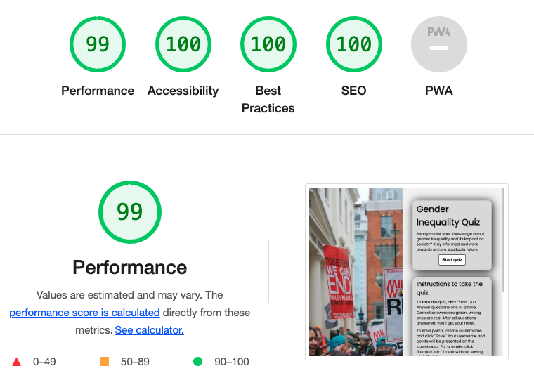
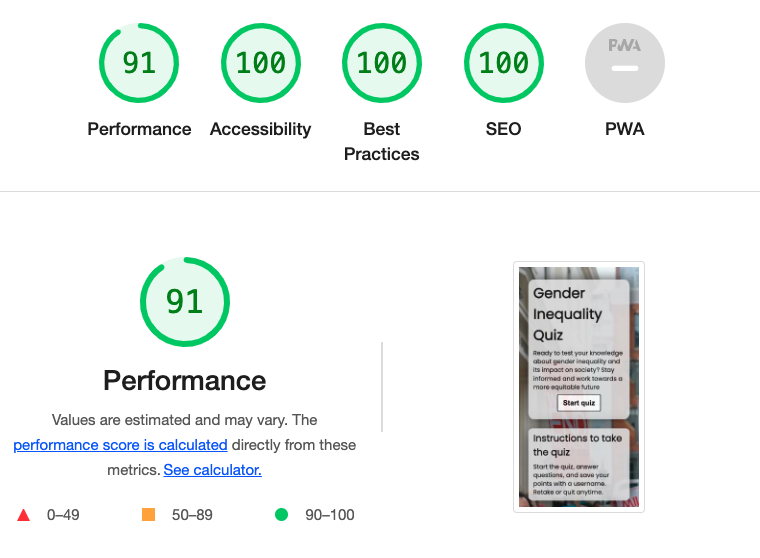

**Manual testing**

Links, form, buttons and Javascript functions were tested manually. 

**Responsiveness**

The website has been initially designed with a desktop-first approach, and throughout the development process, media queries and Flexbox have been employed to ensure responsiveness on a range of screen sizes. In the mobile design, the images are presented as backgrounds behind the text content.Chrome development tools was used throughout the design process to check responsiveness and breakpoints. Adjustments were made accordingly.

**Browser testing**
The website has undergone testing on popular web browsers such as Chrome, Mozilla Firefox, and Safari with no problems found. 

### Bugs
No bugs were detected.

## Deployment
The site is deployed at GitHub as follows: On the GitHub repository, go to Settings/Pages and set the default branch to Main. When the branch is selected the page will display a deployment and the link address.

The live site is found here [The Gender Inequality Quiz](https://aslinedvinsson.github.io/gender_inequality_quiz/) and at the top of the ReadMe.

# Credits
**Mentor**

I owe a great deal of credit to my highly respected mentor, Jad Mokdad, whose support and wise guidance played a pivotal role in shaping the trajectory of this project. His recommendations not only offered valuable guidance but also illuminated the path for me to focus my endeavors most effectively. 

**Photos**
- protest.webp by <a href="https://unsplash.com/@mettyunuabona?utm_content=creditCopyText&utm_medium=referral&utm_source=unsplash" target=”_blank”>Ehimetalor Akhere Unuabona</a> on <a href="https://unsplash.com/photos/a-crowd-of-people-holding-signs-and-flags-UIat6pw8S7A?utm_content=creditCopyText&utm_medium=referral&utm_source=unsplash" target=”_blank” >Unsplash</a>
- talk_about_it.webp by <a href="https://unsplash.com/@mbaumi?utm_content=creditCopyText&utm_medium=referral&utm_source=unsplash" target=”_blank”>Mika Baumeister</a> on <a href="https://unsplash.com/photos/woman-in-yellow-and-red-crew-neck-t-shirt-kyPfAreO7lI?utm_content=creditCopyText&utm_medium=referral&utm_source=unsplash" target=”_blank”>Unsplash</a>
- times_up.webp by <a href="https://unsplash.com/@elyssarenae?utm_content=creditCopyText&utm_medium=referral&utm_source=unsplash" target=”_blank”>Elyssa Fahndrich</a> on <a href="https://unsplash.com/photos/person-carrying-rally-poster-gizHA4cM3Zs?utm_content=creditCopyText&utm_medium=referral&utm_source=unsplash" target=”_blank”>Unsplash</a>
  

**Facts references:**

Facts used to generate questions and answers for the quiz are sourced from the following references.

Question 1, 2, 3 [UN Women](https://www.unwomen.org/sites/default/files/Headquarters/Attachments/Sections/Library/Publications/2019/POWW-2019-Infographic-Chapter-6-Violence-against-women-and-girls-en.pdf)

Question 4 [Raliance](https://www.raliance.org/wp-content/uploads/2018/05/Full-Report-2018-National-Study-on-Sexual-Harassment-and-Assault.pdf)

Question 5 [fokus2030](https://focus2030.org/Overview-of-data-resources-on-gender-equality-across-the-world)

Question 6 [CordAid](https://www.cordaid.org/en/news/why-we-still-need-womens-movements-in-2023-and-beyond/?gclid=CjwKCAjwv-2pBhB-EiwAtsQZFHB2EzOBHkAQADXFI4vAet3KqMZuVEoIp6gvma-V5eIOZzJ3YNjHghoCsB0QAvD_BwE)

Question 7, 8 [WeForum](https://www.weforum.org/publications/global-gender-gap-report-2023/digest)  

Question 9, 10 [UN Women](https://www.un.org/sustainabledevelopment/blog/2023/09press-release-the-world-is-failing-girls-and-women-according-to-new-un-report/) 

**Favicon** 

Favicon designed by corpus delicti from [The Noun project](https://thenounproject.com/) 

## Code from somewhere else

**Template**
Template was generated from [CodeInstitute Github account](https://github.com/Code-Institute-Org).

**Style buttons**

Code for generell styling of buttons are taken from [GetScan](https://getcssscan.com/css-buttons-examples) nr 80.

**Tutorials on how to make a quiz**

How to write the code for questions, options and correct answer is taken from [Making a Quiz in JavaScript by ZetBit](https://www.youtube.com/watch?v=BWR-MDQc65s)

The layout of the quiz questions and options are inspired and learned from [How To Make Quiz App Using JavaScript | Build Quiz App With HTML CSS & JavaScript by GreatStack](https://www.youtube.com/watch?v=PBcqGxrr9g8)

**README layout**

When structuring the README file, I found inspiration in both [Siobhan Gorman's README for the Sourdough Bakes project](https://github.com/siobhanlgorman/Sourdough-Bakes/blob/master/README.md) and the [README for the Love Running project](https://github.com/Code-Institute-Solutions/readme-template ).

